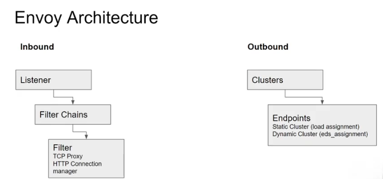

# Feature 1: HTTP Routing and LBing using Envoy

# Table of Contents

- [Links](#links)
- [Envoy Architecture](#envoy-architecture)
  * [Inbound](#inbound)
    + [Listener](#listener)
    + [Filterchain](#filterchain)
    + [Filter](#filter)
  * [Outbound](#outbound)
  * [Clusters](#clusters)
  * [Endpoints](#endpoints)
  * [Upstream clusters](#upstream-clusters)
    + [EDS](#eds)
- [Containers](#containers)
  * [TCP Load balancing](#tcp-load-balancing)
- [Steps to run](#steps-to-run)
- [Tools used](#tools-used)

# Links
1. [Envoy Docs](https://www.envoyproxy.io/docs/envoy/latest/)
2. [Envoy Homepage](https://www.envoyproxy.io/)

# Envoy Architecture

## Inbound 

### Listener
### Filterchain

### Filter

- TCP Proxy
- HTTP Connection manager

## Outbound

## Clusters

## Endpoints

- Static cluster (load_assignment): Example: Config. in YAML/JSON. Better not to use this.
- Dynamic Cluster ([eds](#eds) _assignment): Example: Istio/Consul connect.

## Upstream clusters

### EDS
Endpoint Discovery service

# Containers

## TCP Load balancing
1. Container
  - api1
  - api2
  - envoy

2. Network
  - local
  
3. Ingress
  - frontend (fake-service-0.8.0)

# Steps to run

1. `shipyard run ./tcp-loadbalancing` :  Destroy Container (api1, api2 and envoy), Network(local) and Ingress(frontend)
2. `curl localhost` : Test Load balancing
3. `shipyard destroy` : Destroy Container, Network and Ingress

# Tools used

https://shipyard.run/docs/install/ : CLI

